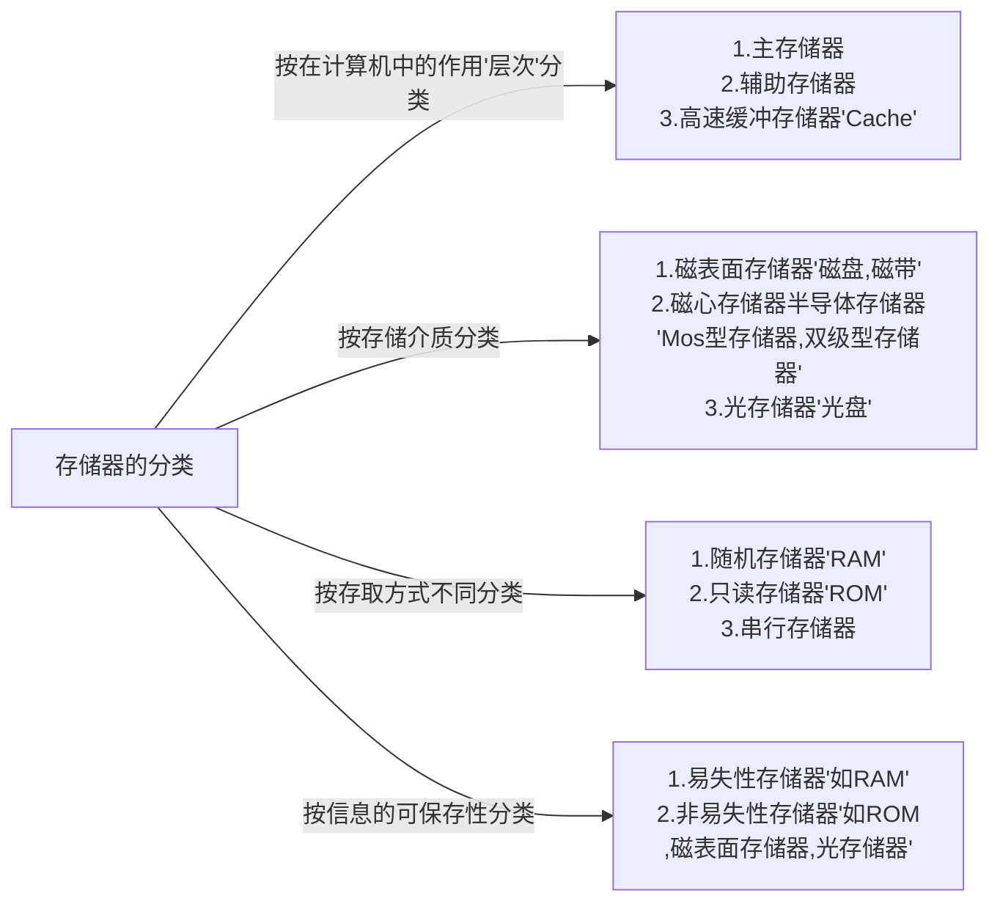
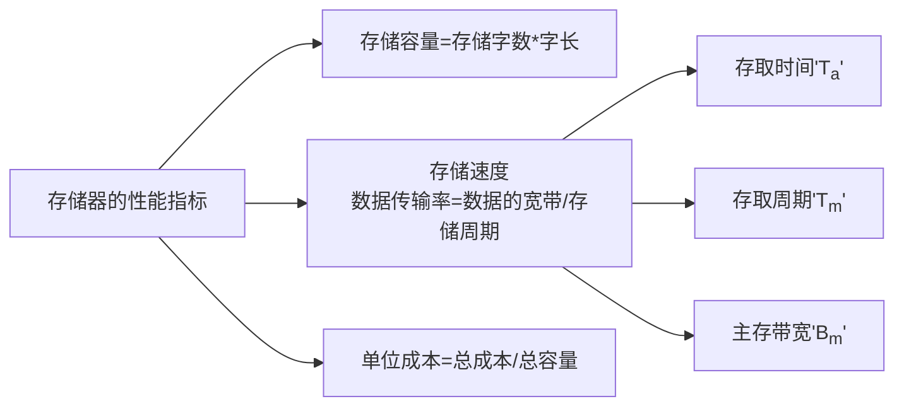

# 存储器概述

## 1.存储器的分类

```mermaid
graph LR
A[存储器的分类]-->|按在计算机中的作用'层次'分类|B[1.主存储器<br>2.辅助存储器<br>3.高速缓冲存储器'Cache']
A-->|按存储介质分类|C[1.磁表面存储器'磁盘,磁带'<br>2.磁心存储器半导体存储器<br>'Mos型存储器,双级型存储器'<br>3.光存储器'光盘'<br>]
A-->|按存取方式不同分类|D[1.随机存储器'RAM'<br>2.只读存储器'ROM'<br>3.串行存储器<br>]
A-->|按信息的可保存性分类|E[1.易失性存储器'如RAM'<br>2.非易失性存储器'如ROM<br>,磁表面存储器,光存储器']
```

## 2.存储器的性能指标

```mermaid
graph LR
A[存储器的性能指标]-->B[存储容量=存储字数*字长]
A-->D[存储速度<br>数据传输率=数据的宽带/存储周期]
D-->D1[存取时间'T<sub>a</sub>']
D-->D2[存取周期'T<sub>m</sub>']
D-->D3[主存带宽'B<sub>m</sub>']
A-->C[单位成本=总成本/总容量]

```

