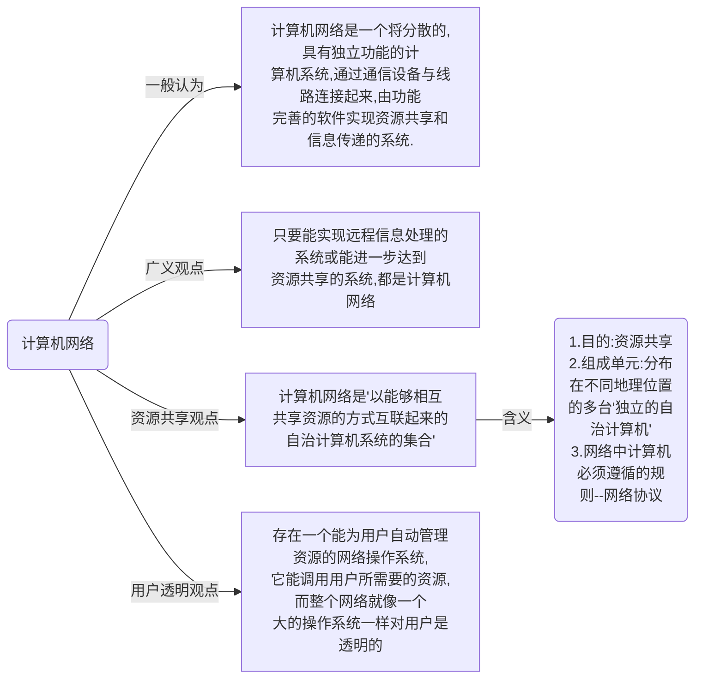
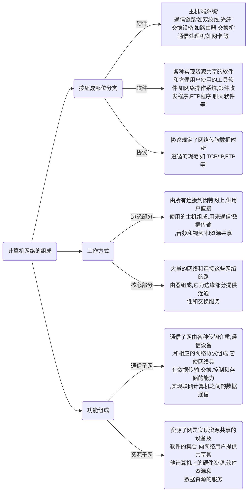
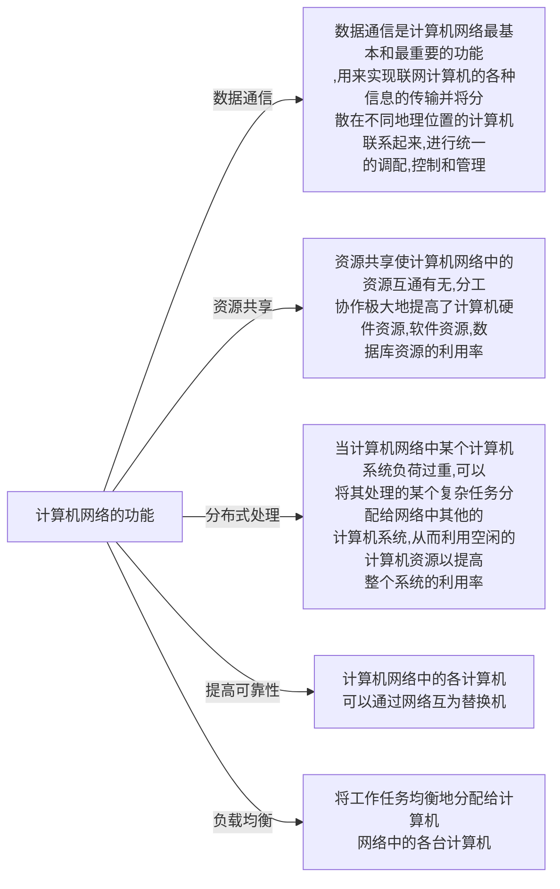
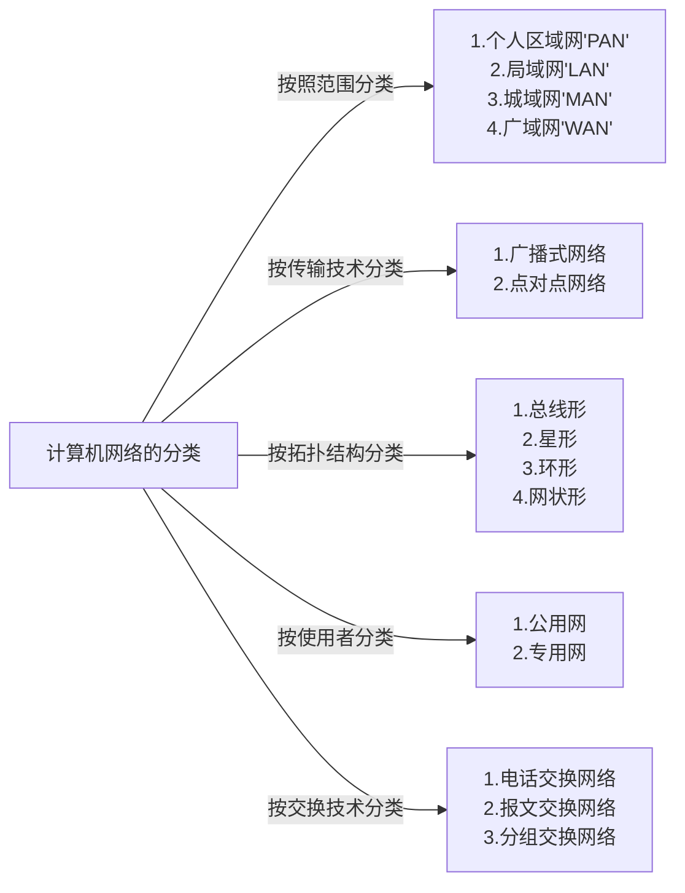
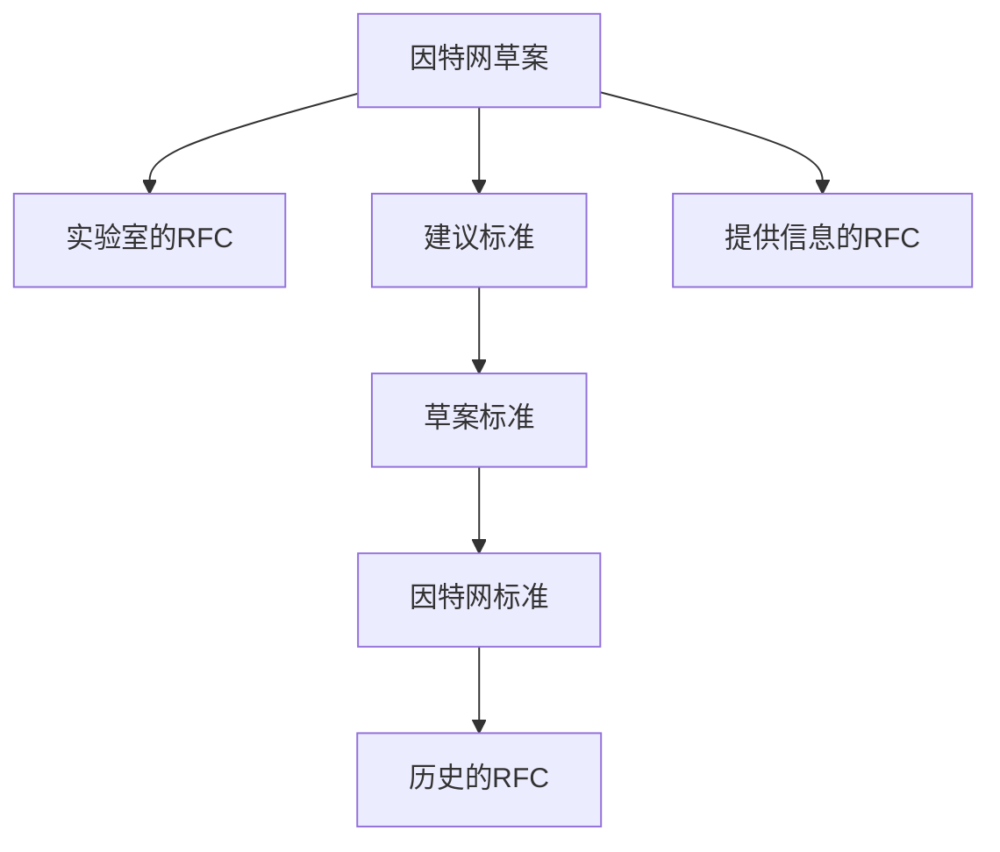
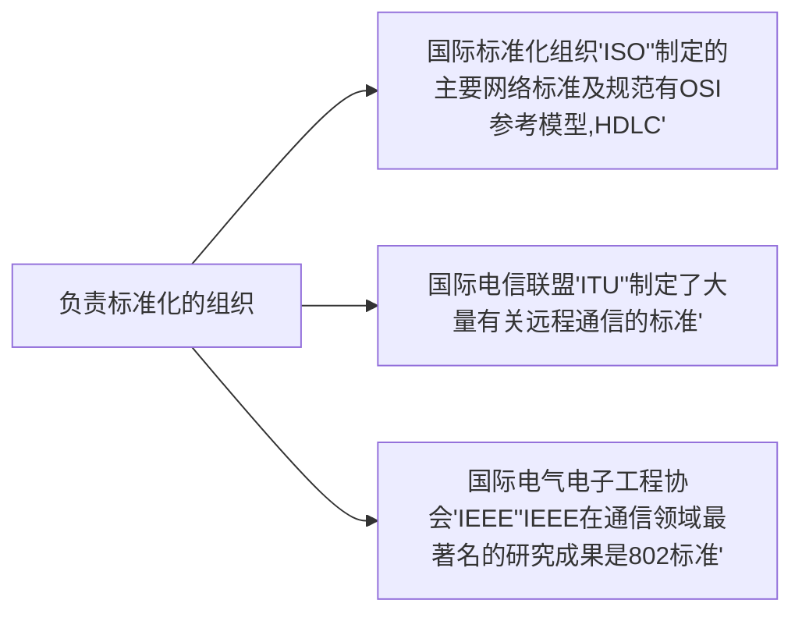
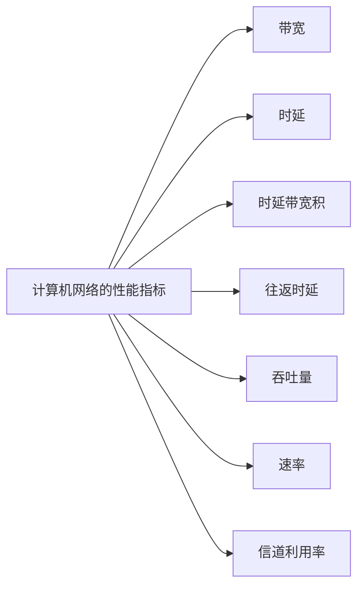

# 计算机网络概述

- [计算机网络概述](#计算机网络概述)
  - [1.计算机网络的概念](#1计算机网络的概念)
  - [2.计算机网络的组成](#2计算机网络的组成)
  - [3.计算机网络的功能](#3计算机网络的功能)
  - [4.计算机网络的分类](#4计算机网络的分类)
  - [5.计算机网络的标准化工作及相关组织](#5计算机网络的标准化工作及相关组织)
  - [6.计算机网络的性能指标](#6计算机网络的性能指标)

## 1.计算机网络的概念

## 2.计算机网络的组成

## 3.计算机网络的功能

此外，计算机网络还可以实现电子化办公与服务,远程教育，娱乐等功能

## 4.计算机网络的分类

## 电路交换与分组交换[^1]

### 1. 电路交换

电路交换用于电话通信系统，两个用户要通信之前需要建立一条专用的物理链路，并且在整个通信过程中始终占用该链路。由于通信的过程中不可能一直在使用传输线路，因此电路交换对线路的利用率很低，往往不到 10%。

### 2. 分组交换

每个分组都有首部和尾部，包含了源地址和目的地址等控制信息，在同一个传输线路上同时传输多个分组互相不会影响，因此在同一条传输线路上允许同时传输多个分组，也就是说分组交换不需要占用传输线路。

在一个邮局通信系统中，邮局收到一份邮件之后，先存储下来，然后把相同目的地的邮件一起转发到下一个目的地，这个过程就是存储转发过程，分组交换也使用了存储转发过程。

## 5.计算机网络的标准化工作及相关组织

由于mermaid编辑器的原因，画复杂图过于杂乱，故画了部分。

## 6.计算机网络的性能指标

## 时延[^1]

总时延 = 排队时延 + 处理时延 + 传输时延 + 传播时延

  
 

### 1. 排队时延

分组在路由器的输入队列和输出队列中排队等待的时间，取决于网络当前的通信量。

### 2. 处理时延

主机或路由器收到分组时进行处理所需要的时间，例如分析首部、从分组中提取数据、进行差错检验或查找适当的路由等。

### 3. 传输时延

主机或路由器传输数据帧所需要的时间。

<!-- 

   -->

  
 

其中 l 表示数据帧的长度，v 表示传输速率。

### 4. 传播时延

电磁波在信道中传播所需要花费的时间，电磁波传播的速度接近光速。

<!-- 

   -->

  
 

其中 l 表示信道长度，v 表示电磁波在信道上的传播速度。

## ISP[^1]

互联网服务提供商 ISP 可以从互联网管理机构获得许多 IP 地址，同时拥有通信线路以及路由器等联网设备，个人或机构向 ISP 缴纳一定的费用就可以接入互联网。

  
 

目前的互联网是一种多层次 ISP 结构，ISP 根据覆盖面积的大小分为第一层 ISP、区域 ISP 和接入 ISP。互联网交换点 IXP 允许两个 ISP 直接相连而不用经过第三个 ISP。

  
 

## 主机之间的通信方式[^1]

- 客户-服务器（C/S）：客户是服务的请求方，服务器是服务的提供方。

  
 

- 对等（P2P）：不区分客户和服务器。

  
 

[^1]:[此部分来自cyc2018仓库](https://github.com/CyC2018/CS-Notes/blob/master/notes/%E8%AE%A1%E7%AE%97%E6%9C%BA%E7%BD%91%E7%BB%9C%20-%20%E6%A6%82%E8%BF%B0.md)