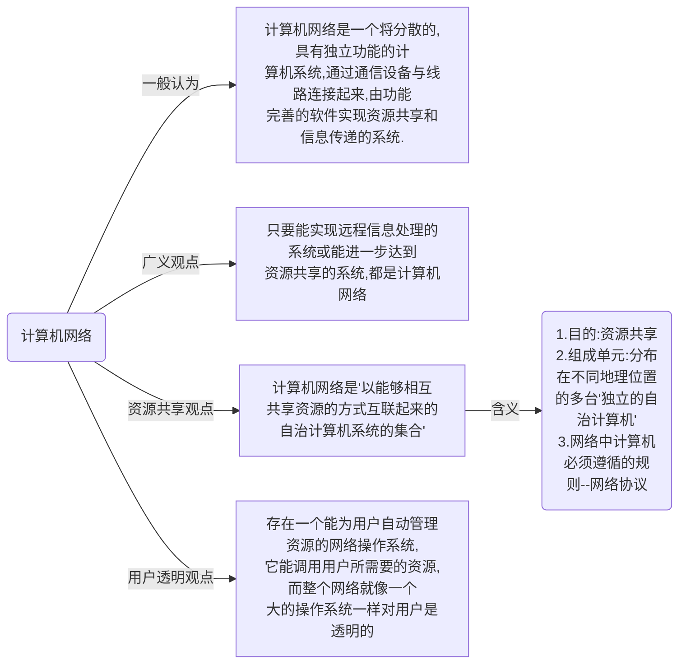
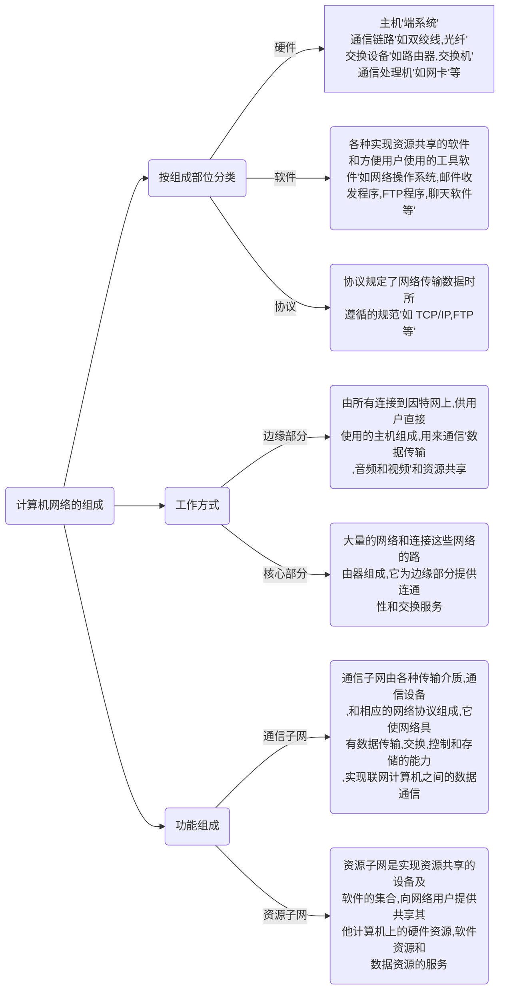

# 计算机网络概述

- [计算机网络概述](#计算机网络概述)
  - [1.计算机网络的概念](#1计算机网络的概念)
  - [2.计算机网络的组成](#2计算机网络的组成)
  - [3.计算机网络的功能](#3计算机网络的功能)
  - [4.计算机网络的分类](#4计算机网络的分类)
  - [5.计算机网络的标准化工作及相关组织](#5计算机网络的标准化工作及相关组织)
  - [6.计算机网络的性能指标](#6计算机网络的性能指标)

## 1.计算机网络的概念

## 2.计算机网络的组成

## 3.计算机网络的功能

## 4.计算机网络的分类

## 5.计算机网络的标准化工作及相关组织

## 6.计算机网络的性能指标

