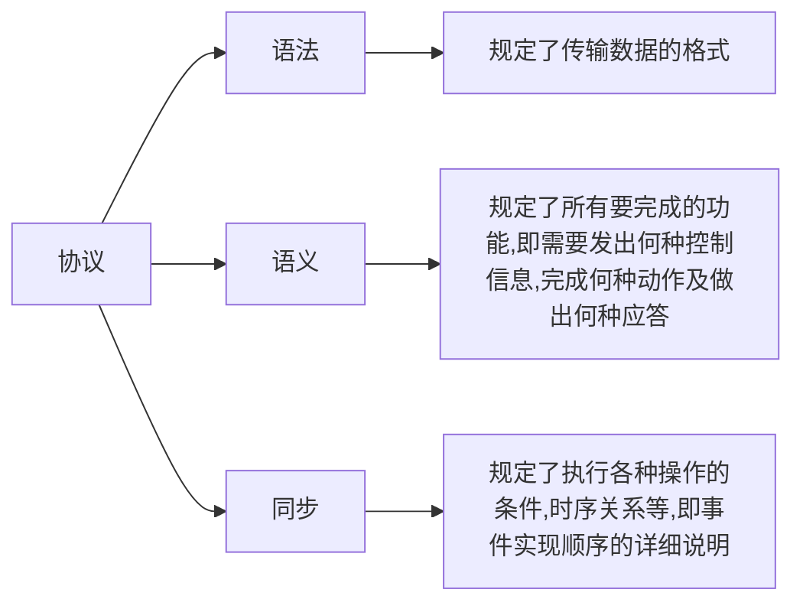
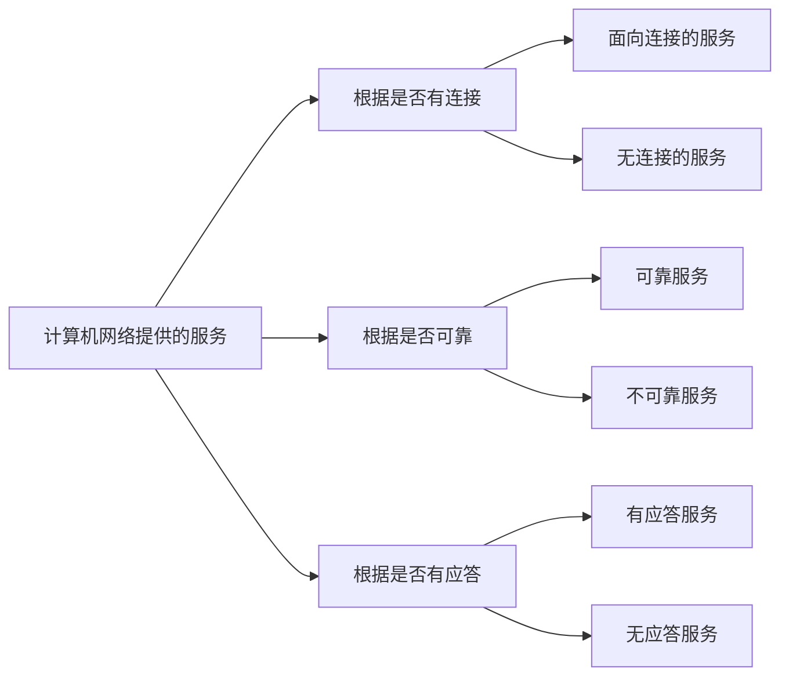

## 计算机网络体系结构与参考模型

将计算机网络的各层及其协议的集合称为网络的体系结构

在计算机网络体系结构的各个层次中，每个报文都分成了两个部分：一是数据部分，即SDU(服务数据单元)[^1]；
二是控制信息部分，即是PCI[^2]；它们共同组成PDU（协议数据单元）[^3]

| OSI  | 五层协议 | TCP/IP |
| :----: | :------: | :--------: |
| 应用层 |        |          |
| 表示层 | 应用层 | 应用层 |
| 会话层 |        |          |
| 运输层 | 运输层 | 运输层 |
| 网络层 | 网络层 | 网际层 |
| 数据链路层 | 数据链路层 | 网络接口层 |
| 物理层 | 网络层 |          |

**计算机网络协议，接口，服务**

**协议**：这些为进行网络中数据交换而建立的规则、标准或约定称为网络协议，它是控制两个(或多个)对等实体进行通信的规则的集合，是水平的。

一个完整的协议通常应具有线路管理(建立，释放连接)，差错控制，数据转换等功能

**接口**：接口是同一结点内相邻两层间交换信息的连接点。在典型的接口上，同一结点相邻两层的实体通过服务访问点(Service Access Point,SAP)进行交互

**服务**：服务是指下层为紧邻的上层提供的功能调用，它是垂直的。对等实体在协议的控制下，使得本层能为上层提供服务，但要实现本层协议还需要使用下一层所提供的服务。

**服务说明某一层为上一层提供一些什么功能;接口说明上一层如何使用下层的服务;协议涉及如何实现本层的服务**

**协议与服务区别**

1.只有本层协议的实现才能保证向上层提供服务；本层的服务用户只能看见服务,不能看见下面的协议，即下层的协议对上层的服务用户是透明的。
2.协议是“水平的”，即协议是控制对等实体之间通信的规则；但服务是”垂直的“，即服务是由下层通过层间接口向上层提供的。
3.此外，并非在一层内完成的全部功能都称为服务，只有那些能够被高一层实体”看得见“的功能才称为服务

**服务的分类**

## 1 、OSI 参考模型

[^1]: 服务数据单元 (SDU):为完成用户要求的功能而应传输的数据。第n层的服务数据单元记为n-SDU.
[^2]:协议控制信息(PCI):控制协议操作的信息。第n层的协议控制信息记为n-PCI.
[^3]:协议数据单元(PDU):对等层次之间传送的数据单元称为该层的PDU。第n层的协议数据单元记为n-PDU.[注：在实际的网络中，每层的协议数据单元都有个通俗的名称。如：物理层的PDU称为比特，链路层的PDU称为帧，网络层的PDU称为分组(包)，运输层的PDU称为报文(段)]