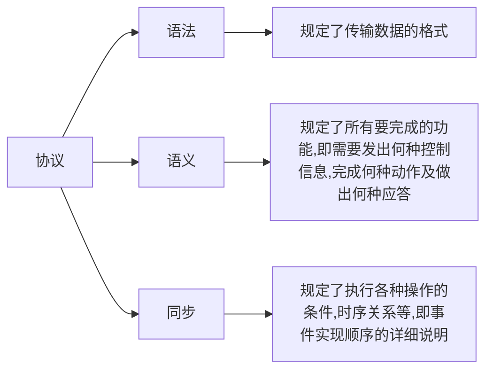
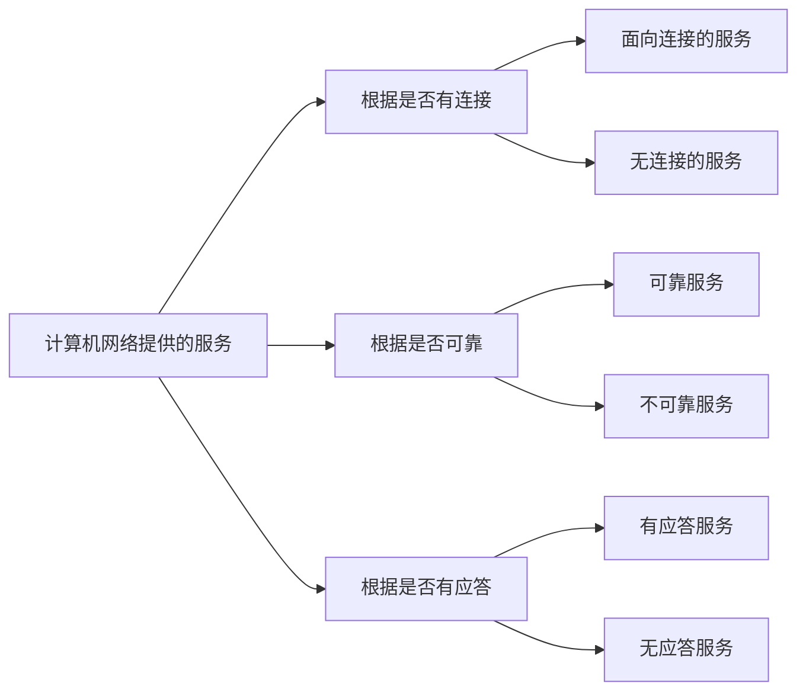

# 计算机网络体系结构与参考模型

将计算机网络的各层及其协议的集合称为网络的体系结构

在计算机网络体系结构的各个层次中，每个报文都分成了两个部分：一是数据部分，即SDU(服务数据单元)[^1]；
二是控制信息部分，即是PCI[^2]；它们共同组成PDU（协议数据单元）[^3]

| OSI  | 五层协议 | TCP/IP |
| :----: | :------: | :--------: |
| 应用层 |        |          |
| 表示层 | 应用层 | 应用层 |
| 会话层 |        |          |
| 传输层 | 运输层 | 运输层 |
| 网络层 | 网络层 | 网际层 |
| 数据链路层 | 数据链路层 | 网络接口层 |
| 物理层 | 网络层 |          |

**计算机网络协议，接口，服务**

**协议**：这些为进行网络中数据交换而建立的规则、标准或约定称为网络协议，它是控制两个(或多个)对等实体进行通信的规则的集合，是水平的。

一个完整的协议通常应具有线路管理(建立，释放连接)，差错控制，数据转换等功能

**接口**：接口是同一结点内相邻两层间交换信息的连接点。在典型的接口上，同一结点相邻两层的实体通过服务访问点(Service Access Point,SAP)进行交互

**服务**：服务是指下层为紧邻的上层提供的功能调用，它是垂直的。对等实体在协议的控制下，使得本层能为上层提供服务，但要实现本层协议还需要使用下一层所提供的服务。

**服务说明某一层为上一层提供一些什么功能;接口说明上一层如何使用下层的服务;协议涉及如何实现本层的服务**

**协议与服务区别**

1.只有本层协议的实现才能保证向上层提供服务；本层的服务用户只能看见服务,不能看见下面的协议，即下层的协议对上层的服务用户是透明的。
2.协议是“水平的”，即协议是控制对等实体之间通信的规则；但服务是”垂直的“，即服务是由下层通过层间接口向上层提供的。
3.此外，并非在一层内完成的全部功能都称为服务，只有那些能够被高一层实体”看得见“的功能才称为服务

**服务的分类**

## 1 、OSI 参考模型

国际标准化组织(ISO)提出的网络体系结构模型，称为开放系统互连参考模型(OSI/RM),简称OSI参考模型，是一个逻辑上的定义，一个规范，它把网络从逻辑上分为了 7 层。

每一层都有相关、 相对应的物理设备，比如路由器，交换机。OSI七层模型是一种框架性的设计方法 ，建立七 层模型的主要目的是为解决异种网络互连时所遇到的兼容性问题，其最主要的功能使就是帮助不同类型的主机实现数据传输。

它的最大优点是将服务、接口和协议这三个概念明确地区 分开来，通过七个层次化的结构模型使不同的系统不同的网络之间实现可靠的通讯。

低三层统称为通信子网,它是为了联网而附加的通信设备,完成数据的传输功能。
高三层统称为资源子网，它相当于计算机系统,完成数据的处理等功能.
传输层承上启下。

### OSI参考模型各层的功能呢

|     层     |       传输单位        |                             任务                             | 功能                                                         |
| :--------: | :-------------------: | :----------------------------------------------------------: | ------------------------------------------------------------ |
|   应用层   | 应用协议数据单元 APDU |         为用户提供网络管理、文件传输、事务处理等服务         | 允许访问网络资源                                             |
|   表示层   | 表示协议数据单元 PPDU | 为在应用过程之间传送的信息提供表示方法的服务，它关心的只是发出信息的语法与语义 | 主要有不同数据编码格式的转换，提供数据压缩、解压缩服务，对数据进行加密、解密 |
|   会话层   | 会话协议数据单元 SPDU |    管理主机间的会话进程，包括建立、管理及终止进程间的会话    | 主机间通讯，管理应用程序之间的会话；规定通信时序；数据交换的定界、同步及创建检查点等。 |
|   传输层   | 数据段（Segment）[^4] |                   负责主机中各个进程的通信                   | 为端到端连接提供可靠服务，流量控制、差错控制、服务质量、数据传输管理等 |
|   网络层   |    数据包(Packet)     | 把网络层的协议数据单元(分组)从源端传送到目的端，为分组交换网上的不同主机提供通信服务 | 对分组进行路由选择，并实现流量控制，拥塞控制，差错控制和网际互连等 |
| 数据链路层 |       帧(Frame)       |               将网络层传过来的IP数据组封装为帧               | 概括为成帧，差错控制，流量控制和传输管理等                   |
|   物理层   |       比特(Bit)       |                       透明地传输比特流                       | 在物理媒介上为数据端设备透明地传输原始比特流                 |

每一层的协议如下： 

|     层     |                          协议                          |
| :--------: | :----------------------------------------------------: |
|   应用层   |         FTP、DNS、Telnet、SMTP、HTTP、WWW、NFS         |
|   表示层   |                    JPEG、MPEG、ASII                    |
|   会话层   |                 NFS、SQL、NETBIOS、RPC                 |
|   传输层   |                     TCP、UDP、SPX                      |
|   网络层   | IP、ICMP、ARP、RARP、OSPF、IPX、RIP、IGRP、 （路由器） |
| 数据链路层 |      ：PPP、FR、HDLC、VLAN、MAC （网桥，交换机）       |
|   物理层   |       RJ45、CLOCK、IEEE802.3 （中继器，集线器）        |

各层的作用

|     层     |                        作用                         |
| :--------: | :-------------------------------------------------: |
|   应用层   |  允许访问 OSI 环境的手段（应用协议数据单元 APDU）   |
|   表示层   | 对数据进行翻译、加密和压缩（表示协议数据单元 PPDU） |
|   会话层   |    建立、管理和终止会话（会话协议数据单元 SPDU）    |
|   传输层   |  提供端到端的可靠报文传递和错误恢复（段 Segment）   |
|   网络层   |   负责数据包从源到宿的传递和网际互连（包 Packet）   |
| 数据链路层 |      将比特组装成帧和点到点的传递（帧 Frame）       |
|   物理层   |   通过媒介传输比特,确定机械及电气规范（比特 Bit）   |

## 2、TCP/IP模型

ARPA在研究**ARPA net**时提出了TCP/IP模型，模型从低到高依次为网络接口层(对应OSI参考模型中的物理层和数据链路层)、网际层、传输层和应用层(对应OSI参考模型中的会话层、表示层和应用层)。

**TCP/IP四层协议**

**网络接口层**：它的功能类似于OSI的物理层和数据链路层；它表示与物理网络的接口，但**实际上TCP/IP本身并没有真正描述这一部分的实现**，只是指出主机必须使用某种协议与网络连接，以便在其上传递IP分组。

**网际层**(主机-主机)：它是TCP/IP体系结构的关键部分。它与OSI网络层在功能上非常相似；网际层**将分组发往目标网络或主机**，并为之选择合适的路由器，但它不保证各个分组有序到达，各个分组的有序交付由高层负责；网际层定义了标准的分组格式和协议，即IP。

**传输层**(应用-应用或进程-进程)：它的功能与OSI中的传输层类似，即使得**发送端和目的端之间的对等实体进行会话**。传输层主要使用以下两种协议：
1.传输控制协议(Transmission Control Protocol ,TCP):它是面向连接的，数据传输单元是报文段，能够提供可靠得多交付。
2.用户数据报协议(User Datagram Protocol,UDP):它是无连接的,数据传输单元是用户数据报，不保证提供可靠的交付,只能提供“尽最大努力交付”。

**应用层**(用户-用户):TCP/IP 模型将 OSI 参考模型中的会话层和表示层的功能合并到应用层实现；包含了所有的高层协议，如虚拟终端协议(Telnet),文件传输协议(FTP),域名解析服务(DNS),电子邮件协议(SMTP)和超文本传输协议(HTTP).

## 3、 OSI模型与TCP/IP模型对比

[^1]: 服务数据单元 (SDU):为完成用户要求的功能而应传输的数据。第n层的服务数据单元记为n-SDU.
[^2]:协议控制信息(PCI):控制协议操作的信息。第n层的协议控制信息记为n-PCI.
[^3]:协议数据单元(PDU):对等层次之间传送的数据单元称为该层的PDU。第n层的协议数据单元记为n-PDU.[注：在实际的网络中，每层的协议数据单元都有个通俗的名称。如：物理层的PDU称为比特，链路层的PDU称为帧，网络层的PDU称为分组(包)，运输层的PDU称为报文(段)]
[^4]:TCP的数据单元称为段（segments）而UDP协议的数据单元称为“数据报（datagrams）