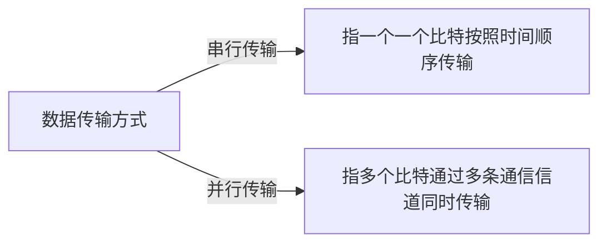

# 通信基础

## 1、基本概念

#### 1、数据、信号和码元

**数据**:传送信息的实体。

**信号**:数据的电气或电磁表现，是数据在传输过程中的存在形式。

- 连续变化的数据(或信号)称为模拟数据(模拟信号)。
- 取值仅允许为有限的几个离散数值的数据(或信号)称为数字数据(数字信号)。

**码元**:指一个固定时长的信号波形(数字脉冲)表示一位k进制数字，代表不同离散数值的基本波形，是数字通信中数字信号的计量单位，这个时长内的信号称为**k进制码元**，而该时长称为码元宽度。一个码元可以携带多个比特的信息量。例如，在使用二进制编码时，只有两种不同的码元：一种代表0状态，一种代表1状态。

#### 2、信源、信道和信宿

数据通信是指数字计算机或与其他数字终端之间的通信。一个数据通信系统主要划分为信源、信道和信宿三部分。

**信源**:产生和发射数据的源头；发射端信源发出的信息需要通过变换器转换为适合在信道上传输的信号

**信宿**:接收数据的终点，他们通常是计算机或其他数字终端装置；通过信道传输到接收端的信号先由反变换器转换为原始信息，再发给信宿。

**信道**:信号传输的媒介。一个信道可视为一条线路的逻辑部件，一般用来表示向某个方向传送信息的介质；通常一条通信线路包含一条发送信道和一条接收信道。

信道按传输信号类型不同分为模拟信道和数字信道；按传输介质分为无线信道和有线信道。

信道上传输的信号有**基带信号**和**宽带信号**；基带信号是将数字0和数字1直接用两种不同的电压表示，然后传输到数字信道上传输(称为基带传输)；宽带信号是将基带信号进行调制后形成频分复用模拟信号，然后传输到模拟信道上去传输(称为宽带传输)。

按照通信双方信息的交互方式可分为:**单工通信**，**半双工通信**，**全双工通信**。

信道的极限容量是指信道的最高码元传输速率或信道的极限信息传输速率。

#### 3、速率、波特和带宽

**速率**:又称数据率，指得是数据的传输速率，表示单位时间内传输的数据量。可以用码元传输速率和信息传输速率表示。

**码元传输速率**:又称码元速率、波形速率、调制速率、符号速率、波特率等，它表示单位时间内数字通信系统所传输的码元的个数(也可称为脉冲个数或信号变化的次数)，单位是波特(Baud).1波特表示数字通信系统每秒传输一个码元。**码元速率与进制数无关**

**信息传输速率**:又称信息速率、比特率等，它表示单位时间内数字通信系统传输的二进制码元的个数(即比特数)，单位为比特/秒(b/s)。

**带宽**:原指信号具有的频率宽带，单位是赫兹(Hz)。但是在实际网络中，由于数据率是信道最重要的指标之一，而带宽与数据率存在数值上的互换关系，因此常常用来表示网络的通信线路所能传输数据的能力。因此，带宽表示单位时间内从网络中的某一点到另一点所能通过的“最高数据率”。此时，带宽的单位不再是HZ，而是b/s.

## 2、奈奎斯特定理和香农定理
#### 1、奈奎斯特定理

奈奎斯特(Nyquist)定理又称奈氏准则，它指出在理想低通(没有噪声,带宽有限)的信道中，极限码元传输率为2W波特，其中W为理想低信道的带宽，单位为Hz。若用V表示每个码元离散电平的数目(码元的离散电平数目是指有多少种不同的码元)，则极限数据率为 **理想低通信道下的极限数据传输率=2Wlog2V(单位为b/s)**

对于奈氏准则，可以得出以下结论:

1、在任何信道，码元传输的速率都是有上限的。若传输速率超过此上限，就会出现严重的码间串扰问题(指在接收端收到的信号波形失去了码元间的清晰界限)，使得接收端不可能完全正确识别码元。

2、信道的频带越宽(即通过的信号高频分量越多)，就可以用更高的速率进行码元的有效传输。

3、奈氏准则给出了码元传输速率的限制，但并未对信息传输速率给出限制，即未对一个码元可以对应多少个二进制位给出限。

由于码元的传输速率受奈氏准则的制约，所以要提高数据的传输速率，就必须设法使得每个码元携带更多个比特的信息量，此时就需要采用多元制的调制方法。

#### 2、香农定理

## 3、编码与调制
#### 1、数字数据编码为数字信号

#### 2、数字数据调制为模拟信号

#### 3、模拟数据编码为数字信号

#### 4、模拟数据调制为模拟信号

## 4、电路交换、报文交换与分组交换
#### 1、电路交换

#### 2、报文交换

#### 3、分组交换

## 5、数据报与虚电路
#### 1、数据报

#### 2、虚电路

